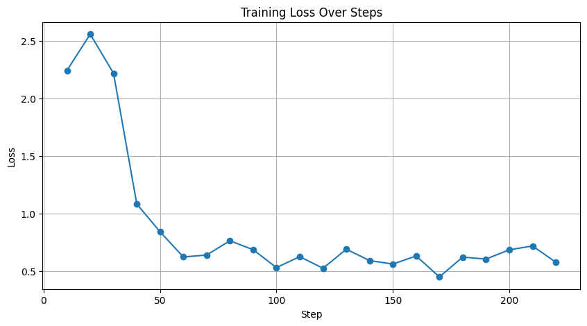

# TerminaLoRA 

## CLI Assistant – Fine-Tuned TinyLlama for Terminal Automation

A lightweight language model fine-tuned using **LoRA** to act as a **CLI assistant** — turning natural language into actionable shell commands. It’s compact, fast, and trained on real-world Q\&A pairs for practical command-line tasks.

---

## 🚀 What It Does

* Accepts **natural language** CLI instructions.
* Responds with **minimal shell commands**.
* Supports **dry-run** mode and logs actions.
---

## 🛠️ Fine-Tuning Details

| **Base Model**    | TinyLlama/TinyLlama-1.1B-Chat-v1.0       |
| ----------------- | ---------------------------------------- |
| **Fine-Tuning**   | LoRA (Low-Rank Adaptation) using 🤗 PEFT |
| **Epochs**        | **3**                                    |
| **Precision**     | 8-bit optimizer (`paged_adamw_8bit`)     |
| **Platform**      | Kaggle T4 GPU                            |
| **Training Time** | \~45 minutes                             |
| **Adapter Size**  | \~8.61 MB                                |

---
## 📉 Training Loss Curve

This graph shows the training loss over time during the 3-epoch fine-tuning of the CLI Assistant model.



---

## 📁 Project Structure

```
.
├── data/                      # Cleaned CLI Q&A dataset (~150 pairs)
├── my_finetuned_model/       # LoRA adapter weights
├── cli_agent.py              # CLI Assistant (inference interface)
├── training.ipynb            # LoRA fine-tuning notebook
├── logs/                     # CLI session logs
│   └── trace.jsonl
```

---

## 🧾 Data Source

* **StackExchange SQL Query**
  Extracted high-quality Q\&A pairs tagged with `bash`, `git`, `grep`.

```sql
SELECT TOP 150
  Posts.Title,
  Posts.Body,
  Answers.Body AS Answer
FROM Posts
JOIN Posts AS Answers ON Posts.AcceptedAnswerId = Answers.Id
WHERE Posts.Tags LIKE '%bash%' OR Posts.Tags LIKE '%git%' OR Posts.Tags LIKE '%grep%'
AND Posts.PostTypeId = 1
ORDER BY Posts.Score DESC
```

* Preprocessed and saved to `data/data_for_finetuning.json`.

---

## 🤖 Run the CLI Agent

```bash
python cli_agent.py
```

Example usage:

```bash
🧠 Enter your CLI instruction:
> Check if Python is installed and show version

💡 AI Plan:
1. python --version

💻 Dry-run Command:
echo python --version

📄 Logged to: logs/trace.jsonl
```

---

## 🔮 Future Work

* **Longer training**: Further epochs may improve ROUGE/BLEU metrics.
* **Multilingual CLI**: Hindi/Spanish tech command generation.
* **Humor-Tuned LLM**: Training with casual, humorous CLI instructions to increase user engagement.

---

## 🏁 Conclusion

This project proves that even **compact models** like TinyLlama can be fine-tuned to perform real-world tasks using LoRA with minimal compute and time. The assistant is fast, effective, and deployable in lightweight environments.

---

created by Vin ❤️
